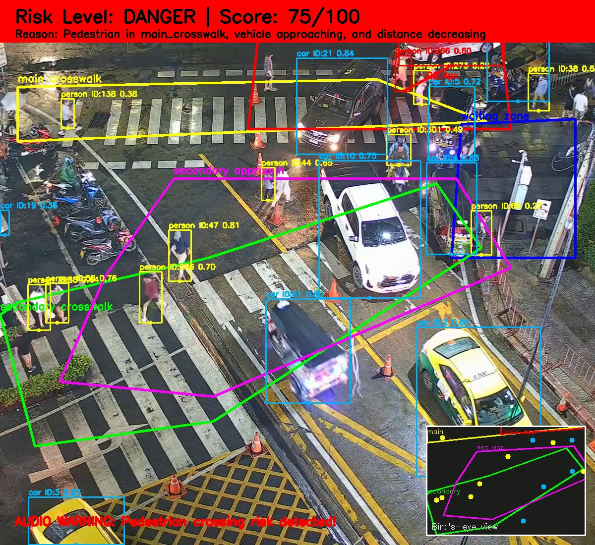
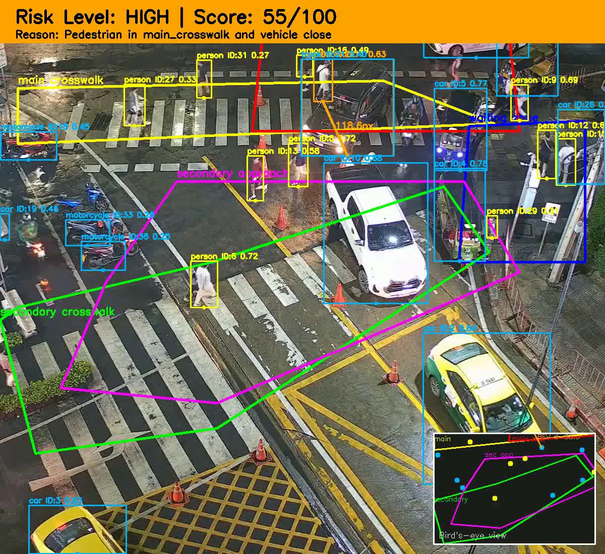
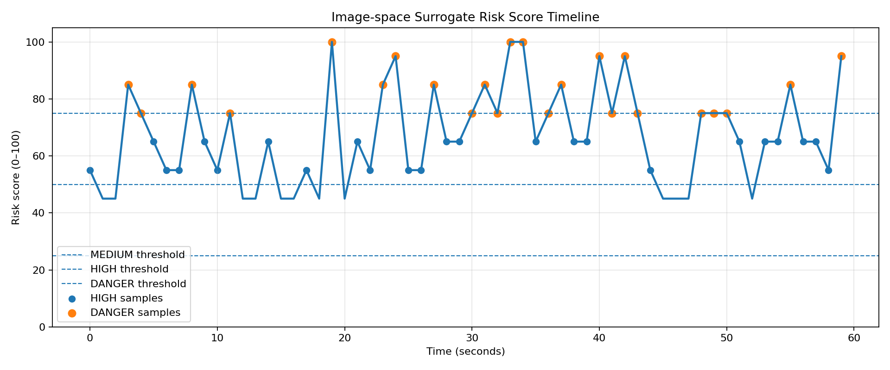

# Vision-based Crosswalk Risk Warning System

## 1. Project Overview

This project implements a computer vision prototype for detecting pedestrian-vehicle risk at unsignalized crosswalks.

The system analyzes CCTV-style crosswalk video using object detection, object tracking, manually defined crosswalk regions of interest, vehicle approach zones, bird's-eye-view visualization, image-space surrogate risk scoring, event logging, screenshot extraction, and English voice warning audio.

The goal is not only to detect pedestrians and vehicles, but also to understand the crosswalk scene and generate warnings when a potentially dangerous pedestrian-vehicle interaction is detected.

---

## 2. Motivation

Pedestrian safety remains an important road-safety issue worldwide. According to the World Health Organization, road traffic crashes cause approximately 1.19 million deaths every year, and more than half of all road traffic deaths occur among vulnerable road users such as pedestrians, cyclists, and motorcyclists.

In South Korea, pedestrian safety is especially important. The ITF/OECD Korea Road Safety Country Profile reported that pedestrians accounted for 35% of all road deaths in Korea in 2022, which is a high share compared with many OECD countries. Seoul has made significant progress in reducing overall traffic fatalities, reaching 180 deaths in 2023 and 1.9 deaths per 100,000 population. However, Seoul continues to invest in pedestrian-oriented infrastructure and crosswalk safety improvements. For example, Seoul reported an 18.4% decrease in traffic accidents after diagonal crosswalk installation, and cases related to failure to protect pedestrians in crosswalks decreased from 34 to 17.

Unsignalized crosswalks are particularly challenging because there is no traffic light to explicitly control the interaction between vehicles and pedestrians. In these locations, vehicles may pass normally when no pedestrian is present, but the situation can quickly become dangerous when a pedestrian enters the crosswalk while a vehicle is approaching.

Therefore, this project focuses on a vision-based pedestrian-vehicle risk warning system for unsignalized crosswalks. The proposed system analyzes CCTV-style video, detects pedestrians and vehicles, estimates risk using image-space surrogate safety indicators, and generates visual and audio warnings when a potentially dangerous interaction is detected.

---

## 3. Main Features

- Pedestrian and vehicle detection using YOLO11s
- Multi-object tracking using ByteTrack
- Main and secondary crosswalk ROI analysis
- Vehicle approach zone analysis
- ROI-aware pedestrian filtering
- Orange bollard/cone false-positive filtering
- Pedestrian-vehicle distance analysis
- Image-space surrogate risk score from 0 to 100
- Risk-level classification: LOW, MEDIUM, HIGH, DANGER
- Frame-level risk logging
- Event-level HIGH/DANGER logging
- Bird's-eye-view mini-map using homography
- Visual warning overlay on output video
- English voice warning audio
- Risk-score timeline plot
- Representative screenshot extraction
- Final H.264 demo video with voice warning
- Experimental real-time webcam deployment mode

---

## 4. System Pipeline

```text
Input CCTV video
→ YOLO11s object detection
→ ByteTrack object tracking
→ Crosswalk ROI analysis
→ Pedestrian and vehicle filtering
→ Image-space surrogate risk scoring
→ Risk-level classification
→ Bird's-eye-view visualization
→ Visual warning overlay
→ Event log and frame log generation
→ English voice warning audio
→ Final H.264 output video
→ Risk-score timeline and representative screenshots
```

---

## 5. Dataset

The input video is a CCTV-style crosswalk video selected from an open dataset source.

For this project, a 60-second segment was extracted from a longer crosswalk video and used as the main demo input.

```
data/demo/crosswalk_best_60s.mp4
```

The selected scene is an unsignalized crosswalk. Because no traffic light is visible in the scene, the project focuses on pedestrian-vehicle risk analysis rather than traffic-light recognition.

---

## 6. Practical Implementation in Real Life

This project simulates how a real-world unsignalized crosswalk could be enhanced using a vision-based pedestrian-vehicle risk warning system.

### Workflow

1. **CCTV Camera**: Mounted above the crosswalk, continuously monitors pedestrian and vehicle activity.
2. **CV Pipeline**: YOLO11s + ByteTrack detects and tracks pedestrians and vehicles in real time.
3. **Risk Assessment**: Calculates image-space surrogate risk score for each pedestrian-vehicle interaction.
4. **Audio Warning**: If HIGH or DANGER risk is detected, the system plays an English voice warning through a nearby speaker (e.g., "Caution. Pedestrian crossing." or "Warning. Vehicle approaching. Please stop.").
5. **Monitoring Continues**: If no risk is detected, the system continues monitoring without warnings.
6. **Event Logging**: All HIGH/DANGER events are logged for later analysis and review.

### Workflow Diagram (Simplified)

```text
[Pedestrian enters crosswalk]
          │
          ▼
[Camera/CCTV detects pedestrian]
          │
          ▼
[CV pipeline detects vehicles + pedestrians]
          │
          ▼
[Compute image-space risk score]
          │
          ▼
[Risk HIGH/DANGER?] ──► Yes ──► [Play voice warning + overlay on output video]
          │
          └───────────► No ──► [No warning, continue monitoring]
```
This section illustrates how the prototype **mimics a real unsignalized crosswalk safety system** with real-time detection, risk scoring, and English voice warnings.

---

## 7. Object Detection and Tracking

This project uses YOLO11s for object detection and ByteTrack for multi-object tracking.

Detected classes include:
```
person
bicycle
car
motorcycle
bus
truck
```
The system tracks object IDs across frames and uses the bottom-center point of each bounding box as the representative image-space position.

---

## 8. Crosswalk ROI and Scene Understanding

The system uses manually defined regions of interest because the camera view is fixed.

The ROI configuration includes:

* Main crosswalk ROI
* Secondary crosswalk ROI
* Vehicle approach zone
* Secondary vehicle approach zone
* Pedestrian waiting zone
* Homography source points for bird's-eye-view visualization

The ROI file is located at:
```
config/crosswalk_roi.json
```
Because this is an unsignalized crosswalk, vehicle presence alone is not treated as dangerous. The system increases risk only when pedestrians are inside or near the crosswalk and vehicles are close, approaching, or located in relevant approach zones.

---

## 9. Image-space Surrogate Risk Score

The project computes an image-space surrogate risk score from 0 to 100.

The score is inspired by surrogate safety measures such as minimum distance, closing speed, and time-to-collision-like indicators. However, because this prototype does not perform full real-world metric calibration, the score is computed in image space rather than meters.

The risk score combines:
```
risk_score =
    pedestrian exposure score
  + proximity score
  + closing-speed score
  + TTC-like score
  + approach-zone score
```
### 9.1 Pedestrian Exposure
```
No relevant pedestrian                  → low score
Pedestrian in waiting zone              → medium exposure
Pedestrian inside crosswalk             → high exposure
```
### 9.2 Minimum Distance

Minimum image-space distance between a pedestrian and a vehicle is used as a proximity indicator.

Smaller distance produces a higher risk contribution.

### 9.3 Closing Speed

The system estimates image-space closing speed from tracking history.
```
closing_speed_px_per_frame =
    previous_distance - current_distance
```
If the pedestrian-vehicle distance decreases quickly, the risk score increases.

### 9.4 TTC-like Indicator

The system estimates an approximate TTC-like value in image space:
```
ttc_like_frames = current_distance_px / closing_speed_px_per_frame
ttc_like_sec    = ttc_like_frames / fps
```
This is not a real-world TTC measurement. It is an image-space approximation used for prototype-level risk analysis.

### 9.5 Risk Level Mapping
```
0–24    LOW
25–49   MEDIUM
50–74   HIGH
75–100  DANGER
```

---

## 10. Risk Logic

The final risk level is derived from the risk score.

Risk Level	| Description
LOW	        | No relevant pedestrian in the crosswalk or waiting zone
MEDIUM	    | Pedestrian is waiting or moderate surrogate risk is detected
HIGH	    | Pedestrian-vehicle interaction has high surrogate risk
DANGER	    | Short TTC-like condition, critical proximity, or very high surrogate risk

Example overlay:
```
Risk Level: DANGER | Score: 85/100
Reason: Pedestrian in main_crosswalk and short TTC-like risk detected
```

---

## 11. Bird's-eye-view Visualization

The system includes an approximate bird's-eye-view mini-map using homography.

This visualization helps show the spatial relationship between:

* Pedestrians
* Vehicles
* Crosswalk regions
* Vehicle approach zones
* Dangerous pedestrian-vehicle pairs

The homography is used for visualization only. It is not used as certified metric calibration.

Example result images are saved in:
```
assets/results/
```

---

## 12. Audio Warning Simulation

When a risk event is detected, the system generates an English voice warning.

* HIGH event: `Caution. Pedestrian crossing.`
* DANGER event: `Warning. Vehicle approaching. Please stop.`

The generated voice audio is merged into the final output video to simulate a speaker-based warning system that could be installed near an unsignalized crosswalk.

Generated audio file:
```
outputs/videos/warning_audio_voice.wav
```
Final video with voice warning:
```
outputs/videos/output_crosswalk_risk_yolo11s_60s_with_voice_h264.mp4
```

---

## 13. Output Logs

The project generates two types of CSV logs.

### 13.1 Event Log

The event log records HIGH and DANGER events.
```
outputs/logs/event_log_crosswalk_yolo11s_60s.csv
```
Columns:
```
frame_id
time_sec
risk_level
risk_score
person_count
vehicle_count
min_distance_px
ttc_like_sec
closing_speed_px_per_frame
reason
screenshot_path
```
### 13.2 Frame Log

The frame log records risk status approximately once per second.
```
outputs/logs/frame_log_crosswalk_yolo11s_60s.csv
```
This log is used to generate the risk-score timeline plot.

---

## 14. Risk-score Timeline

The system generates a risk-score timeline plot.
```
assets/results/risk_score_timeline.png
```
This plot shows how the risk score changes over time and marks the MEDIUM, HIGH, and DANGER thresholds.

Example output from the final run:
```
Event log:
HIGH      17
DANGER    11

Frame-level log:
HIGH      24
DANGER    24
MEDIUM    12
```

---

## 15. Representative Results

Representative result images are saved in:
```
assets/results/
```
Example files:
```
assets/results/danger_example_1.jpg
assets/results/danger_example_2.jpg
assets/results/danger_example_3.jpg
assets/results/high_example_1.jpg
assets/results/high_example_2.jpg
assets/results/crosswalk_risk_30s.mp4
assets/results/crosswalk_risk.mp4
assets/results/risk_score_timeline.png
```
### Danger Example


### High-risk Example


### Risk-score Timeline


### Demo Video

This repository includes a **30-second demo video** showing the main pipeline and audio warning functionality:

#### 30-second Demo
[▶ Click to watch video](https://github.com/user-attachments/assets/09d10b2a-ede5-485f-a41a-9c4f02f357b3)

**Full 60-second video** is also included in the repository:

#### Full 60-second Video
[▶ Click to watch video](https://github.com/user-attachments/assets/1476dc87-ea7e-4763-93f0-2de724de5af6)

- Both videos contain the English voice warning and risk overlays.
- The 30-second demo is lightweight for preview, while the full 60-second video shows the complete crosswalk scenario.

---

## 16. How to Run

### 16.1 Install Dependencies
```
pip install -r requirements.txt
```
### 16.2 Run the Full Pipeline
```
python main.py --config config/config.yaml
```
This command runs:
```
object detection
tracking
risk scoring
visualization
event logging
frame logging
voice warning generation
H.264 video export
risk-score timeline generation
representative screenshot extraction
```
### 16.3 Run Only the Computer Vision Pipeline
```
python main.py --config config/config.yaml --skip-audio
```
This mode skips voice-warning generation and H.264 audio merging.

---
 
## 17. Experimental Real-time Webcam Mode

This repository also includes an experimental webcam mode:
```
python run_webcam.py --source 0
```
To save webcam output:
```
python run_webcam.py --source 0 --save
```
This mode performs real-time YOLO11s detection and ByteTrack tracking from a local webcam.

Important note:
```
The webcam mode is experimental.
ROI-based risk scoring requires camera-specific ROI calibration.
The current ROI configuration is designed for the provided CCTV-style demo video.
```
Therefore, webcam mode is included as an optional deployment experiment, not as the main evaluated pipeline.

---

## 18. Project Structure

```text
vision-based-crosswalk-risk-warning/
├── README_project.md
├── requirements.txt
├── main.py
├── run_webcam.py
├── config/
│   ├── config.yaml
│   └── crosswalk_roi.json
├── src/
│   ├── audio_warning.py
│   ├── cv_pipeline.py
│   └── report_assets.py
├── data/
│   └── demo/
│       └── crosswalk_best_60s.mp4
├── docs/
│   ├── crosswalk_risk.mp4
│   └── crosswalk_risk_30s.mp4
│      
├── assets/
│   └── results/
│       ├── danger_example_1.jpg
│       ├── high_example_1.jpg
│       ├── crosswalk_risk.mp4
│       ├── crosswalk_risk_30s.mp4
│       └── risk_score_timeline.png
└── outputs/
    ├── logs/
    │   ├── event_log_crosswalk_yolo11s_60s.csv
    │   └── frame_log_crosswalk_yolo11s_60s.csv
    └── videos/
        ├── output_crosswalk_risk_yolo11s_60s_with_voice_h264.mp4
        └── warning_audio_voice.wav
```
---

## 19. Limitations
* The system uses image-space distance, not real-world metric distance.
* ROI regions are manually defined for the selected fixed CCTV view.
* Homography is approximate and used mainly for bird's-eye-view visualization.
* The TTC-like value is an image-space approximation, not a calibrated physical TTC.
* The system may be affected by occlusion, lighting changes, and small distant pedestrians.
* YOLO may produce false positives or miss objects in difficult conditions.
* Voice warning is simulated and not connected to real speaker hardware.
* Webcam mode requires camera-specific ROI calibration for full risk scoring.

---

## 20. Future Work
* Metric homography calibration using real-world crosswalk measurements
* Real-world vehicle speed estimation in meters per second
* Post-Encroachment Time estimation using conflict-point crossing times
* Automatic crosswalk segmentation
* More robust pedestrian trajectory prediction
* Real IoT speaker integration
* Multi-camera deployment
* Weather/nighttime robustness testing
* Multilingual warning messages

--- 

## 21. References
* World Health Organization. Global status report on road safety 2023.
* World Health Organization. Road safety fact sheet.
* International Transport Forum / OECD. Korea Road Safety Country Profile 2023.
* Seoul Metropolitan Government. Seoul’s Traffic Mortality Hit a Record Low in 2023.
* Seoul Metropolitan Government. Seoul Expands Installation of Diagonal Crosswalks After 18% Drop in Traffic Accidents.
* Noh et al. Analysis of Vehicle–Pedestrian Interactive Behaviors near Unsignalized Crosswalks.
* Ultralytics YOLO documentation.
* ByteTrack tracking through Ultralytics.
* OpenCV documentation.
* gTTS documentation.
* pydub documentation.
